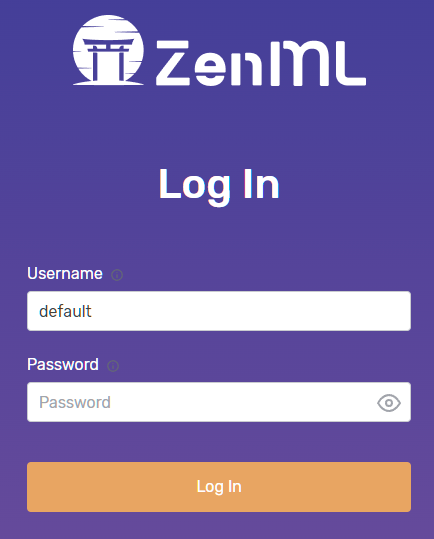
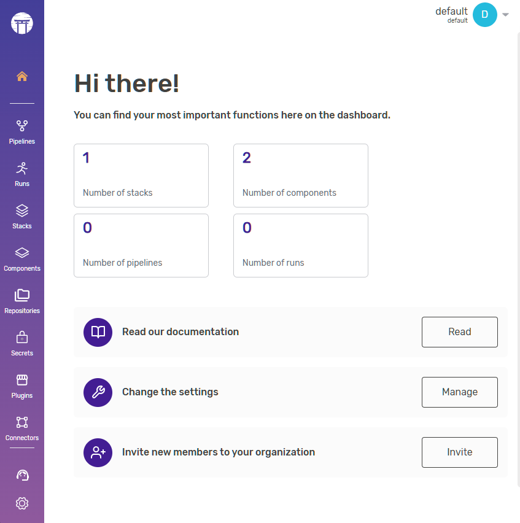

# Open Source MLOps with ZenML and OpenShift

## OpenShift and MLOps
[Red Hat OpenShift](https://www.openshift.com) makes sense in a lot of contexts. It's one of the most comprehensive solutions for developing and running Kubernetes applications and the frameworks that help build them. If you can think of it, it's likely you can develop and run it on OpenShift in some way, shape or form.

Machine Learning Operations or [MLOps](https://www.redhat.com/en/resources/mlops-architecture-openshift-infographic) is a term for operationalizing machine learning (ML) for DevOps and ML engineers. There are many solutions out there for making MLOps easier. For instance, Red Hat has [OpenShift Data Science](https://www.redhat.com/en/technologies/cloud-computing/openshift/openshift-data-science). However, we encourage those in the community who have other innovative ways of doing things to bring those solutions to OpenShift as well. It's designed from the ground up to facilitate that.

 Today we'll look at [ZenML](https://github.com/zenml-io/zenml). As describe on their project page, it is: 
 
 > an extensible, open-source MLOps framework for creating portable, production-ready machine learning pipelines. By decoupling infrastructure from code, ZenML enables developers across your organization to collaborate more effectively as they develop to production.

A perfect cadidate to run within the OpenShift ecosystem.

In this exercise we'll be using the OpenShift command line utility, otherwise known as "`oc`" to deploy the [ZenML](https://github.com/zenml-io/zenml) Server via a docker build strategy to build your own zenml-server image. This way as the ZenML open source project continues to evolve you'll be able to evolve with it and hopefully contribute to the project in a meaningful way through your own contributions as you learn more about it.

### Let's get started

This exercise assumes that you have an existing OpenShift cluster and are logged in via the command line using `oc`. If you need help getting started with OpenShift please visit [Red Hat OpenShift Getting Started](https://developers.redhat.com/products/openshift/getting-started). Once you've got an environment up and running move on to step 1 below.


Create a new project
```bash
oc new-project zenml
```
Create a new application
```bash
oc new-app --strategy=docker --binary --name=zenml
```
Open up your favorite editor and create a Dockerfile with the following contents:
```Dockerfile
ARG PYTHON_VERSION=3.9
FROM python:${PYTHON_VERSION}-slim AS base

ENV PYTHONFAULTHANDLER=1 \
    PYTHONUNBUFFERED=1 \
    PYTHONHASHSEED=random \
    PIP_NO_CACHE_DIR=1 \
    PIP_DISABLE_PIP_VERSION_CHECK=1 \
    ZENML_CONTAINER=1

ARG ZENML_VERSION

# install the given zenml version (default to latest)
RUN pip install zenml${ZENML_VERSION:+==$ZENML_VERSION}

FROM base AS server

RUN pip install zenml${ZENML_VERSION:+==$ZENML_VERSION}[server,secrets-aws,secrets-gcp,secrets-azure,secrets-hashicorp,s3fs,gcsfs,adlfs,connectors-aws,connectors-gcp,connectors-azure]

WORKDIR /zenml

ENV ZENML_CONFIG_PATH=/zenml/.zenconfig \
    ZENML_DEBUG=false \
    ZENML_ANALYTICS_OPT_IN=true

ARG USERNAME=zenml
ARG USER_UID=1001
ARG USER_GID=$USER_UID

# Create the user
RUN groupadd --gid $USER_GID $USERNAME \
    && useradd --uid $USER_UID --gid $USER_GID -m $USERNAME

RUN mkdir -p /zenml/.zenconfig/local_stores/default_zen_store && \
chgrp -R 0 /zenml && \
chmod -R g=u /zenml

ENV PATH="$PATH:/home/$USERNAME/.local/bin"

ENTRYPOINT ["uvicorn", "zenml.zen_server.zen_server_api:app",  "--log-level", "debug"]
CMD ["--proxy-headers", "--port", "8080", "--host",  "0.0.0.0"]
```

--- 

Now use that Dockerfile to build an image and deploy it to a pod in OpenShift
```bash
oc start-build zenml --from-dir <path to Dockerfile>
```

Wait for the build to be complete. You can check by executing the following command:

To see the build progress use the following command:
```bash
oc logs build/zenml-1 -f
```

We can now create the service and associated routes to access the zenml server

First create a service:
```bash
oc expose deployment/zenml --port 8080
```
Then we'll create a route you'll be using to access the ZenML Server. 

```bash
oc create route edge zenml --service=zenml --insecure-policy='Allow'
```

Now you can run the following to see what you've created:

```bash
oc get svc,route
```
You should see something similar to this:
```
NAME            TYPE        CLUSTER-IP      EXTERNAL-IP   PORT(S)    AGE
service/zenml   ClusterIP   172.30.38.137   <none>        8080/TCP   26s

NAME                             HOST/PORT                               PATH   SERVICES   PORT    TERMINATION   WILDCARD
route.route.openshift.io/zenml   zenml-zenml.apps.cluster.example.com          zenml      <all>   edge/Allow    None

```

At this point we can now access the ZenML Server Web UI via the OpenShift route you created in the previous step in the browser of your choice. For instance, in this example I would use the following in my address bar:

```http://zenml-zenml.apps.cluster.example.com```


Once the login comes up, login with Username "default" and the password you can leave blank. Then press the `Log In` button.



After providing your e-mail for the ZenML (or not) move on to the next page and you should see a dashboard similar to this:



## Simple

Congratulations! Now you have ZenML Server running on OpenShift. You can expolore the ZenML open source project and all it's possibilities on [GitHub](https://github.com/zenml-io/zenml). Good luck and have fun!

## Want more?

Please let us know if you'd like to see more MLOps with OpenShift in the future. In the meantime watch a couple of Red Hatters talk about MLOps over coffee:

[OpenShift Coffee Break: MLOps with OpenShift](https://www.youtube.com/live/5zHumreNS_k?si=jUBp7zvjDUD3rtBi)

And if you're interested in getting some hands on with Red Hat Open Data Science check out this OpenShift Developer Sandbox activity:

[How to create a natural language processing (NLP) application using OpenShift Data Science](https://developers.redhat.com/developer-sandbox/activities/use-rhods-to-master-nlp)

You can also visit the upstream [Open Data Hub](https://opendatahub.io/) to get more involved in the open source AI on Hybrid Cloud action.